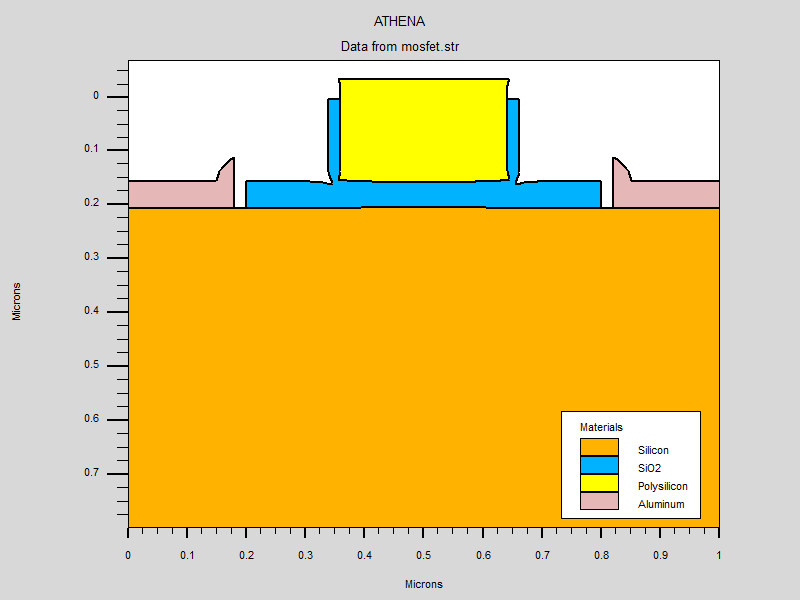
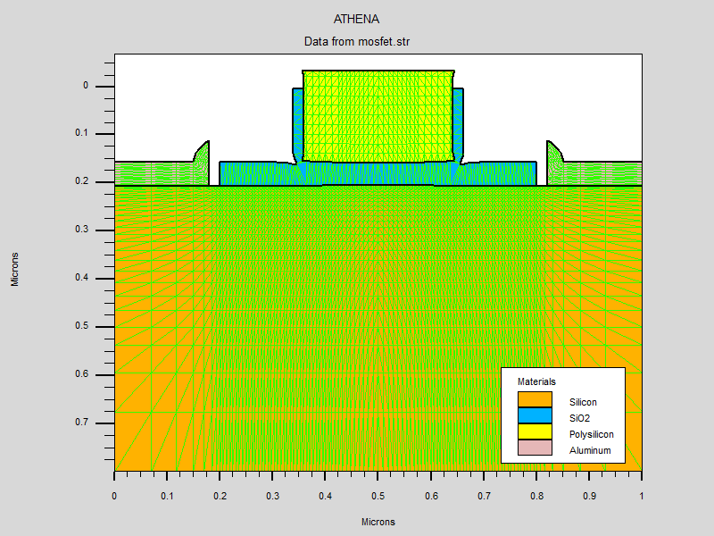

# MOSFET Design and Simulation (Silvaco TCAD)

This repository contains the full process and device simulation for a sub-micron MOSFET using the **Silvaco TCAD** suite. The project utilizes **ATHENA** for process fabrication and **ATLAS** for electrical characterization.

## 🚀 Project Overview

The simulation follows a standard fabrication flow for an N-channel MOSFET, followed by an $I_D-V_{DS}$ sweep to analyze the transistor's performance under different gate biases.

### Key Features:
* **Process Flow:** Substrate initialization, dry oxidation, polysilicon gate deposition, Arsenic S/D implantation, and aluminum metallization.
* **Device Physics:** Use of SRH, CVT, and Boltzmann models for accurate carrier transport simulation.
* **Characterization:** Multi-bias $I-V$ curve generation (1V, 2V, and 5V gate bias).

---

## 🛠️ Simulation Flow

### 1. Fabrication (ATHENA)
The device is built on a P-type Silicon substrate ($1 \times 10^{15}$ Boron concentration).
* **Grid Definition:** High-density mesh at the surface and channel regions for precision.
* **Gate Stack:** 0.2µm Polysilicon layer over a grown thermal oxide.
* **Source/Drain:** Arsenic implantation ($5 \times 10^{15} \text{ cm}^{-2}$) with subsequent diffusion.
* **Electrodes:** Specific naming for Gate, Source, Drain, and Substrate (backside).

### 2. Device Analysis (ATLAS)
The electrical simulation solves for carrier transport across the structure.
* **Interface Charge:** $Q_f = 3 \times 10^{10} \text{ cm}^{-2}$.
* **Voltage Sweep:** $V_{DS}$ is ramped from $0\text{V}$ to $3.3\text{V}$.
* **Output:** Generates log files for three distinct $V_{GS}$ levels to compare saturation current.

---

## 📊 Visual Results

### Process & Structural Output
The fabrication results in a symmetrical MOSFET structure with defined doping profiles and a optimized mesh for numerical stability.

| **Final Structure** | **Doping Concentration** | **Simulation Mesh** |
| :---: | :---: | :---: |
|  |  |  |

### Electrical Characteristics
The $I_D-V_{DS}$ curves below demonstrate the MOSFET entering the saturation region as Drain Voltage increases.


---

## 💻 Simulation Script

The core logic is contained in the `.in` file. Below is the simplified block for the $I-V$ sweep:

```tcad
# ATLAS Characterization Block
solve vgate=1 outf=solve_tmp1
solve vgate=2 outf=solve_tmp2
solve vgate=5 outf=solve_tmp3

load infile=solve_tmp1
log outf=mos1.log
solve name=drain vdrain=0 vfinal=3.3 vstep=0.3
